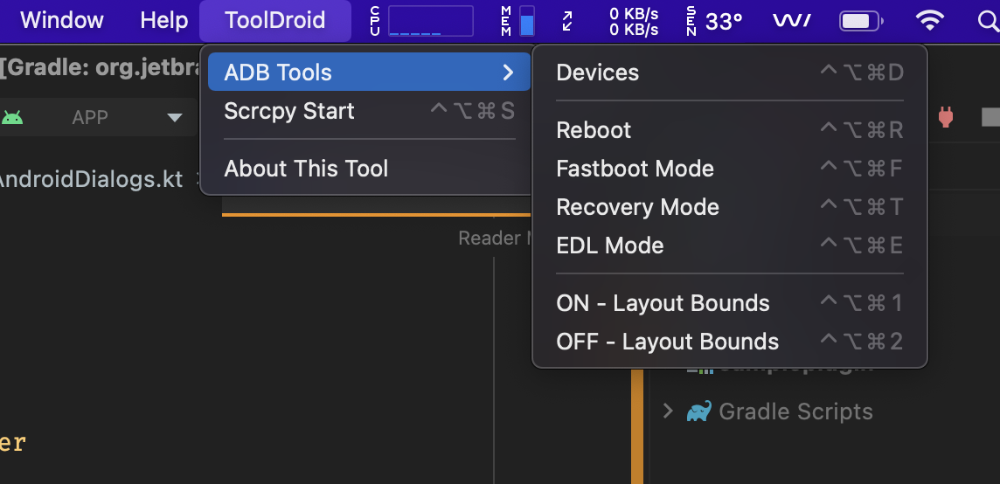

# ToolDroid

#### This Tool is mainly developed for Android Engineers, Which makes easy to work with ADB 

## Requirements
1. ADB
2. SCRCPY [Download](https://github.com/Genymobile/scrcpy)
## About the Tool Features

1. Shows all the connected devices ( Ctrl+Alt+Windows+D )
2. Screen mirroring ( Ctrl+Alt+Windows+S )
3. Rebooting the device ( Ctrl+Alt+Windows+R )
4. Rebooting the device into Recovery ( Ctrl+Alt+Windows+T )
5. Rebooting the device into Fastboot or Bootloader ( Ctrl+Alt+Windows+F )
6. Rebooting the device into EDL ( Ctrl+Alt+Windows+E )
7. Turing OFF/ON the Layout Bound ( Ctrl+Alt+Windows+(1/2) )
